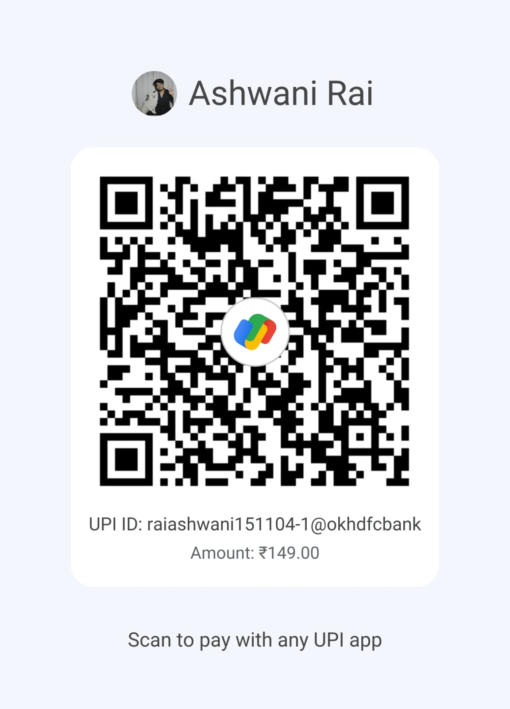

## 🎥 Live Preview

# 💳 Paytm Clone - Premium Fintech Portfolio Project

A high-performance, visually stunning **Paytm Clone** built with Vanilla JavaScript, HTML5, and CSS3, powered by **Capacitor** for a native Android experience. This project features a full payment flow, real-time notifications, and a professional QR scanning system.

---

## 💰 Get the Full Source Code (APK + Web)

You can purchase the latest, production-ready source code of this Paytm Clone for a premium portfolio or business base.

- **Price**: ₹149 (One-time payment)
- **UPI ID**: `ashwani-rai@ptyes`

### 🛒 How to Purchase:
1.  **Pay via UPI**: Use the ID `ashwani-rai@ptyes` or scan the QR code below:
    
    

2.  **Send Confirmation**: Take a screenshot of the successful payment.
3.  **Get Access**: Send the payment screenshot and your **GitHub Username** via WhatsApp: 
    
    [**💬 Chat on WhatsApp**](https://wa.me/917050440715?text=Hi%20Ashwani%2C%20I%20have%20purchased%20the%20Paytm%20Clone%20source%20code.%20Here%20is%20my%20payment%20screenshot%20and%20GitHub%20username%3A)
4.  **Invitation**: You will be added as a **Collaborator** to this private repository within 1 hour, giving you full access to download/clone the code.

---

## 🚀 Key Features

- 📸 **Advanced QR Scanner**: Seamless QR code detection and parsing for instant payments.
- 💸 **Full Payment Flow**: Simulated end-to-end payment experience with custom PIN entry and success screens.
- 🔔 **Dynamic Notification System**: Supports both **Firebase Cloud Messaging (FCM)** and **Local Notifications** with a custom in-app floating banner.
- 🖼️ **Shareable Receipts**: Generate high-quality, professional payment receipts with serrated edges and dynamic data.
- 📋 **Payment History**: Beautifully categorized transaction history with detailed receipt views.
- 📱 **Native Android Support**: Fully synchronized with Capacitor for a smooth mobile experience.
- 🌓 **Aesthetics-First Design**: Premium glassmorphism effects, smooth animations, and a polished UI that mimics the latest Paytm app.

---

## 📸 Screenshots & Demo

|  |  |  |
|:---:|:---:|:---:|
|  |  |  |
|  |  |  |

---

## 🤝 Contributing

Contributions are welcome! If you have ideas for new features or UI improvements, feel free to open an issue or submit a pull request.

---

## 📄 License

This project is licensed under the ISC License.

---

**Built with ❤️ by [Ashwani Rai](https://github.com/ashurai1)**
